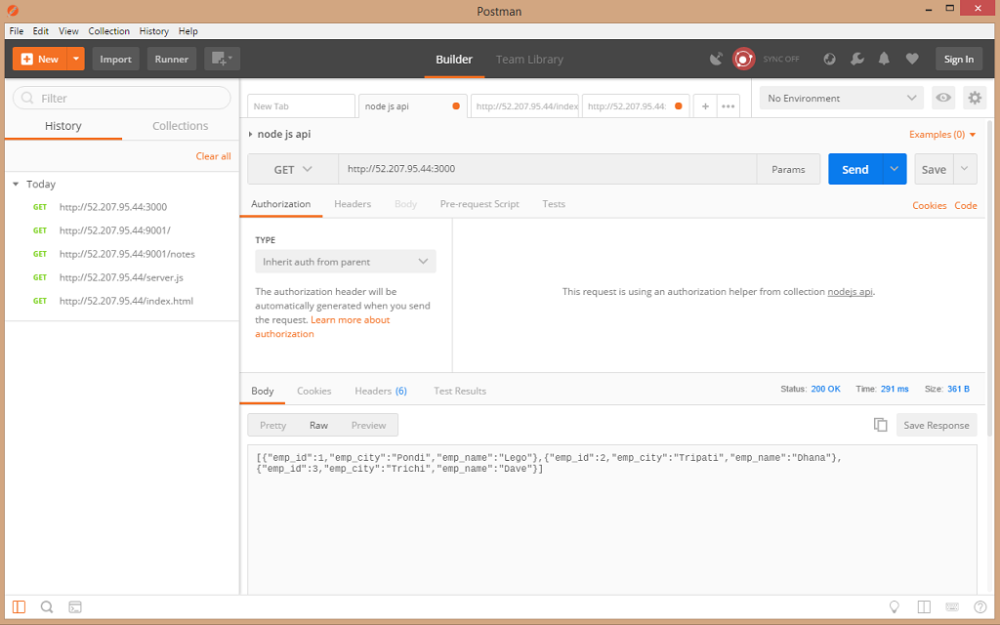
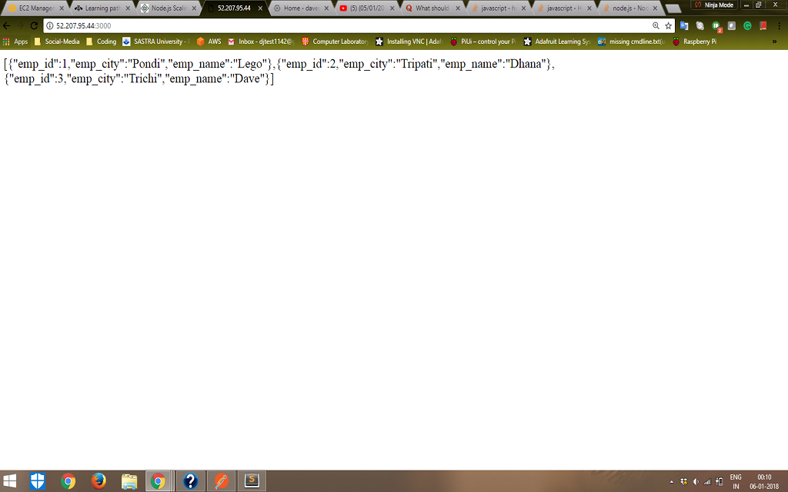
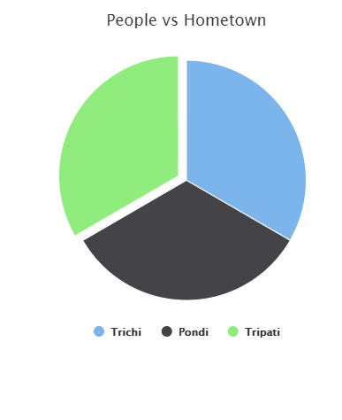
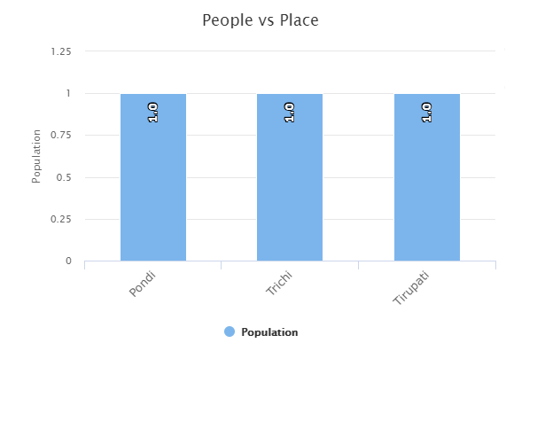

# Restful API Creation to extract Cassandra data

### Description
Exposing the data from Cassandra DB running in an instance to external world by running a NodeJS server. The tools, frameworks and technologies involved are:
  * [Cassandra](http://cassandra.apache.org/) - Contains our data!
  * [NodeJS](https://nodejs.org/en/download/) - Server-side scripting Language!
  * [ExpressJS](https://expressjs.com/) - Framework for building API!
  * [Postman](https://www.getpostman.com/) - To test the API!


### Installation

Initially check the version of node and npm.

```sh
$ npm --version
$ node --version
```

This package requires [Node.js](https://nodejs.org/) and [ExpressJS](https://expressjs.com/) to function. Initialize the npm module using `$ npm init` command. 

Install the dependencies and devDependencies.
```sh
$ npm install -g express
$ npm install -g nodemon
$ npm install -g cassandra-driver
```

Check the installation of the packages using `$ ls node_modules #(dir node_modules for windows)`command


### Steps

1. Create the `main.js` file
```sh
$ vi main.js 
```

2. Use this [link](source-code/main.js) in a straight-forward approach. For asynchronous calls use this [link](source-code/main-asyncall.js)

3. Replace the keyspace `davekeyspace1`	with your keyspace

4. Optional Customization :

* contactPoints (127.0.0.1) 
* Cassandra execute query (Select * from davetable)
* Port number (3000)


5. Run the `$ nodemon --inspect main.js` command to start the server

6. Try hitting the endpoint `youripaddress:port`. eg., `54.54.204.204:3000`


### Response
The output is in json. 
```json
[{"emp_id":1,"emp_city":"Pondi","emp_name":"Lego"},
 {"emp_id":2,"emp_city":"Tripati","emp_name":"Dhana"},
 {"emp_id":3,"emp_city":"Trichi","emp_name":"Dave"}]
```

Response in Postman



Response on Browser



### Troubleshooting
1. If port number is occupied, then try `$ killall -9 node`
2. To check if API works in local instance, try `$ curl localhost:3000`


### Visualization

Some sample visualization achieved using the JSON (Built using Highchart)





### Contact 
* David Jegan  - [Linkedin](https://www.linkedin.com/in/david-jegan-abishek-39556684/) - [Mail](mailto:mailtodavidjegan@gmail.com)
